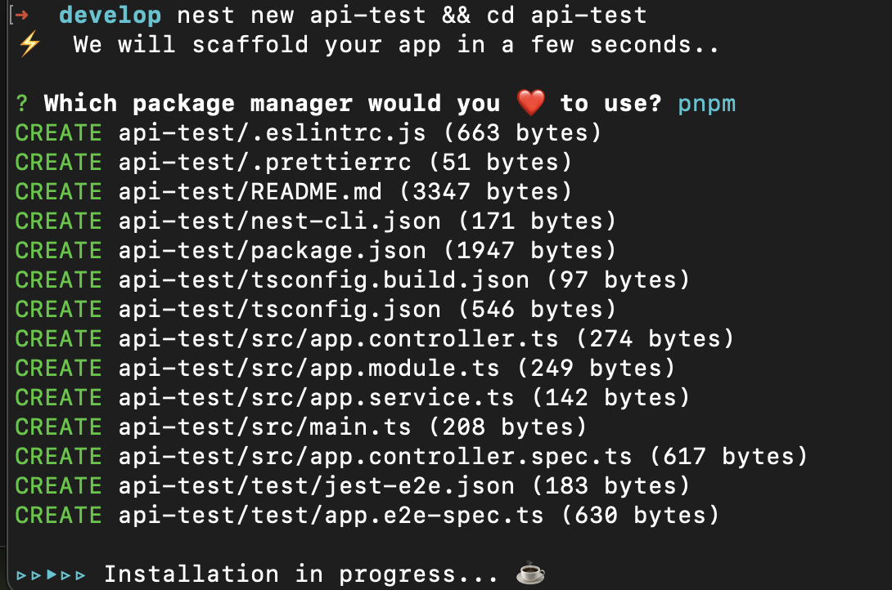
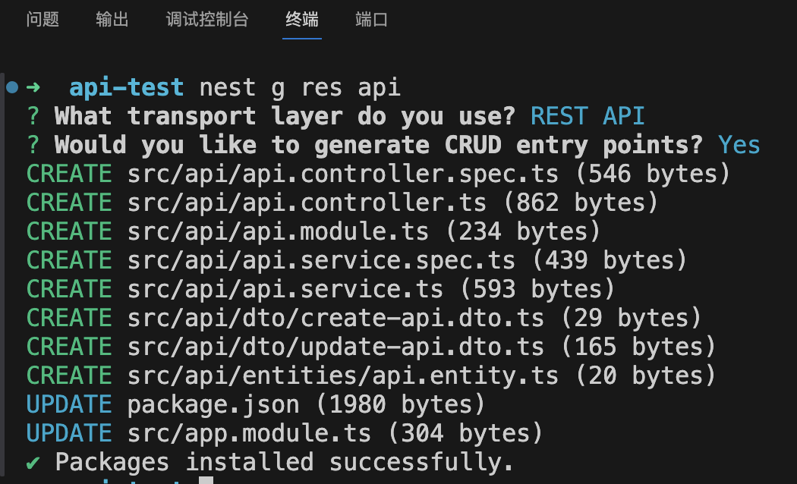
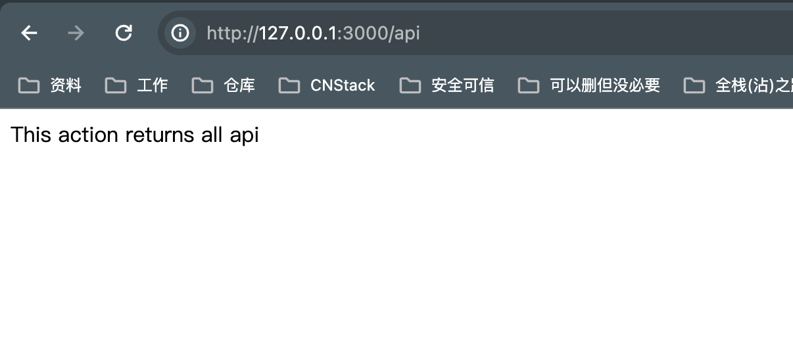
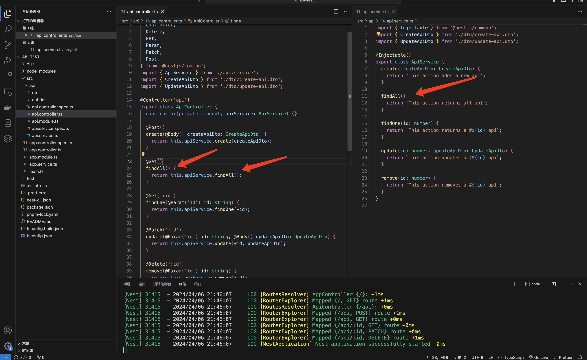

# 创建第一个API 🤩

## 创建项目

终端使用 nestjs/cli 脚手架创建项目
```bash
$ nest new api-test
$ cd api-test
```


## 运行项目
```bash
$ pnpm run start
```
或者开发者模式下使用
```bash
$ pnpm run start:dev
```
nestjs framework 默认监听端口3000

修改的话可以查看src/main.ts 中 app.listen中的端口

```typescript
import { NestFactory } from '@nestjs/core';
import { AppModule } from './app.module';

async function bootstrap() {
  const app = await NestFactory.create(AppModule);
  await app.listen(3000);
}
bootstrap();

```
## 浏览器访问
打开浏览器，访问127.0.0.1:3000
## 新增第一个API
在项目根目录下，打开终端，运行
```bash
$ nest g res api
```


打开浏览器，访问 127.0.0.1:3000/api



## 查看api模块


由此图可看出，当浏览器访问/api路由时，进入api.controll.ts中的被Get()修饰的findAll函数， 随后调用api.service.ts中的findAll模块，返回出此字符串。


 
