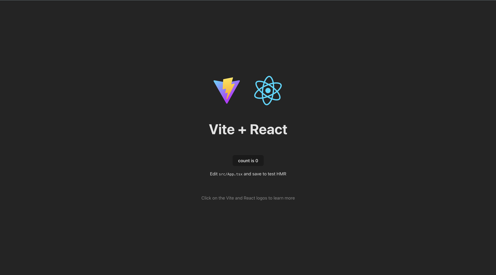

# 安装使用 react

## react 构成

1. react 主要包含了 React 的核心功能，如组件的创建、状态管理、生命周期方法等，它提供了用于构建用户界面的基础 API，允许开发者定义和组合 React 组件
2. react-dom 专门处理将 react 组件渲染到 DOM 中,它提供了与浏览器相关的 DOM 操作方法，如 ReactDOM.render()，用于将 React 元素插入到 HTML 页面的某个节点中, 负责与浏览器的 DOM 进行交互，实现 UI 的实际渲染和更新

## react 使用

react 最常用的方法是使用 react cli 进行创建 react 项目，常见的脚手架有 create-react-app(不维护)、umijs、nextjs、vite 等等～，后续我将使用 vite 脚手架进行 react 学习～

这里我使用两种方式创建 react 项目，vite 以及原生 html 引用，我们先使用最原始的方式进行 react 的使用～

### 创建 html 文件直接使用 react

```html
<!DOCTYPE html>
<html>
  <head>
    <meta charset="UTF-8" />
    <title>Hello World</title>
    <script src="https://unpkg.com/react@18/umd/react.development.js"></script>
    <script src="https://unpkg.com/react-dom@18/umd/react-dom.development.js"></script>
    <script src="https://unpkg.com/@babel/standalone/babel.min.js"></script>
  </head>
  <body>
    <div id="root"></div>
    <script type="text/babel">
      function MyApp() {
        return <h1>Hello, world!</h1>;
      }

      const container = document.getElementById("root");
      const root = ReactDOM.createRoot(container);
      root.render(<MyApp />);
    </script>
  </body>
</html>
```

将此文件在浏览器打开即可查看页面展示 Hello, world!

### 使用 vite 脚手架进行创建

怎么使用 vite 这里去找 👉 [vite](https://vitejs.cn/vite3-cn/guide/#scaffolding-your-first-vite-project)

1. 创建 vite 项目，这里使用 react-ts 模版创建 react 项目

```bash
pnpm create vite vite-react-app --template react-ts
```

2. 下载依赖

```bash
cd vite-react-app && pnpm install
```

3. 运行 vite 项目

```bash
pnpm run dev
```

浏览器访问 [localhost:5173](localhost:5173)

项目启动～

::: info
🎉 恭喜少年，你的 react 之路由此展开
:::
